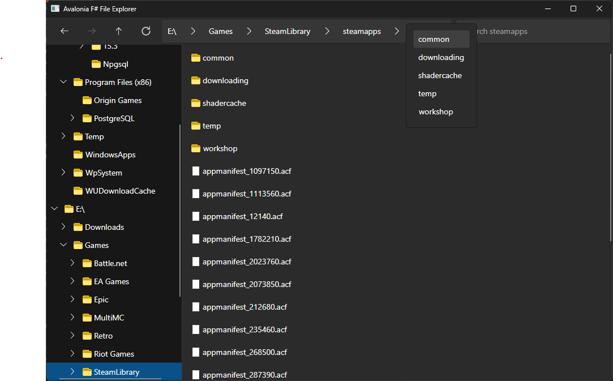

# Example of implementing a basic file explorer using Avalonia UI in F#

## Functionality/Features:
- Tree view of file system (from all root devices)
    - Expand nodes to display subfolders
    - Navigate folders via the tree view and display folders in the explorer view
- Explorer view that displays files and folders
    - Navigation by selecting folders through the explorer view
    - Open files 
- Toolbar for navigation and filtering
    - Backkwards/Forwards navigation
    - Navigate to parent directory
    - 'Breadcrumbs' of directory parents
        - Dynamically adjusts number of 'breadcrumbs' shown based on window size (naive implementation currently)
    - Navigation to subfolders by clicking on the ">" button in the address bar
    - Filter files (basic text filtering)

## TODO?
- Saving state 
    - Window size
- Display meta data/metrics
    - Number of items in a directory
    - File size / date created / last modified / etc.
- More advanced search functionality
    - Search patterns (e.g. regex)
    - Extend search to subfolders 
- Resizable SplitView
- Refactor/clean-up